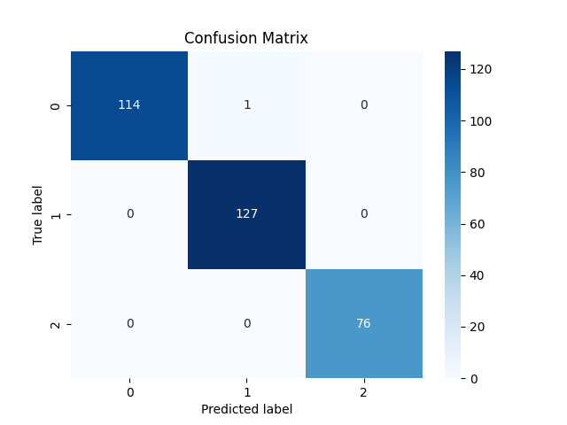

# 🥛 Milk Quality Classification using ML Models
This project applies several classification algorithms to predict the grade (quality) of milk using chemical and physical properties. 
Models used include Logistic Regression, Decision Tree, Gradient Boosting, and XGBoost with hyperparameter tuning.

## 📊 Dataset
This project uses the Milk Quality Dataset from Kaggle.

Target Variable: grade — the quality of the milk

- 0 → Low
- 1 → Medium
- 2 → High
The dataset contains 1,059 samples and 8 features, including pH, temperature, taste, odor, fat content, turbidity, and color.

## 🚀 Workflow

Data Loading and Inspection
- Loaded dataset using pandas
- Verified shape and absence of missing values
- Mapped grade categories to numerical values (low → 0, medium → 1, high → 2)

Data Visualization

- Plotted histograms for ph and temperature
  
Feature and Target Selection

- X: All features except grade
- y: grade (encoded)

Train-Test Split

- 70% training, 30% testing using train_test_split

Model Training & Evaluation

-> Trained the following models:

- Logistic Regression
- Decision Tree
- Gradient Boosting (default)
- XGBoost (default and tuned)

-> Used accuracy_score, classification_report, and confusion_matrix for evaluation

-> Visualized confusion matrix using seaborn

## 🧾 Results Summary

| Model                       | Accuracy |
|-----------------------------|----------|
| Logistic Regression         | 0.6981   |
| Decision Tree               | 0.9937   | 
| Gradient Boosting (50 trees)| 0.9905   | 
| XGBoost (50 trees)          | 0.9968   | 
| XGBoost (Tuned)             | 1.0000   |

## 📈 Confusion Matrix

Example of confusion matrix for the test set:



## ⚙️ Installation

1. Clone the repo:

```bash
git clone https://github.com/yourusername/milk_quality_classifier_xgboost.git
cd milk_quality_classifier_xgboost
```
2. **Install dependencies:**:   
```commandline
pip install -r requirements.txt
```

📂 Files in This Repo

- milk_quality_classifier.ipynb: Jupyter notebook with full analysis, training, evaluation, and visualizations
- requirements.txt: All required Python libraries (pandas, imblearn, scikit-learn, matplotlib, seaborn)

👨‍💻 Author

Yoseph Negash

📧 yosephn22@gmail.com

📅 2025


